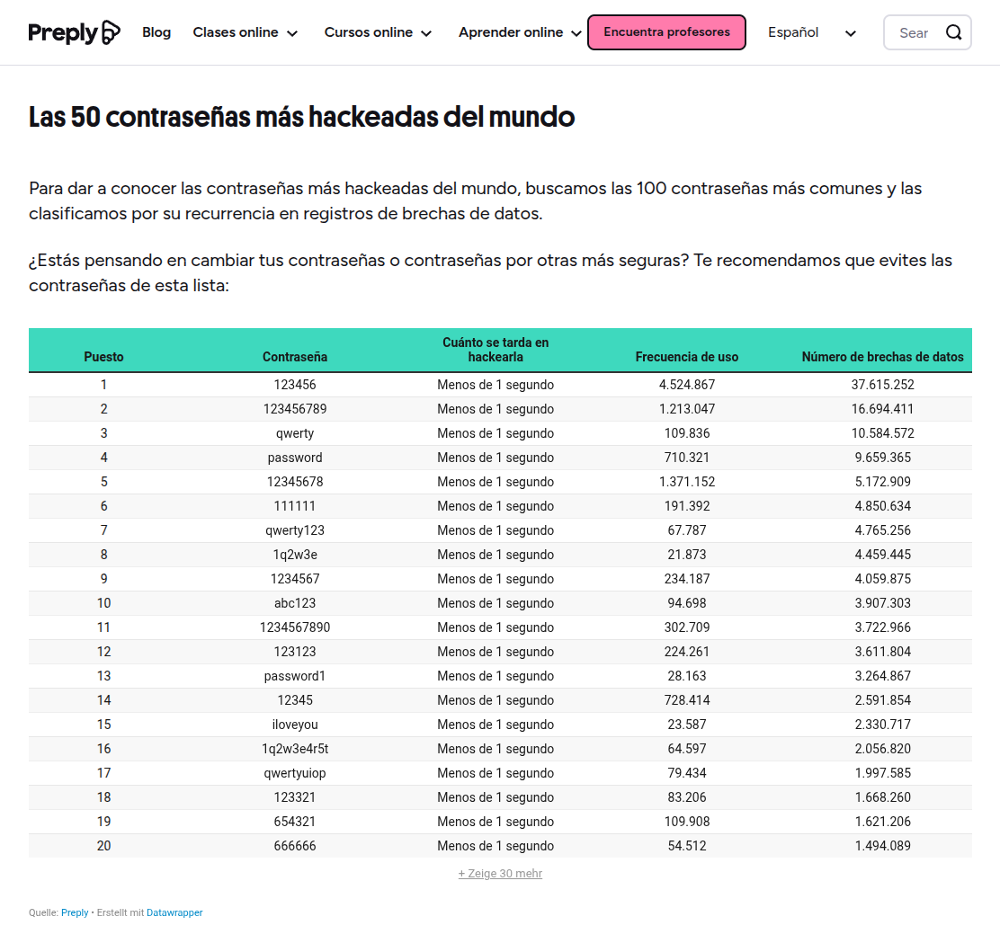
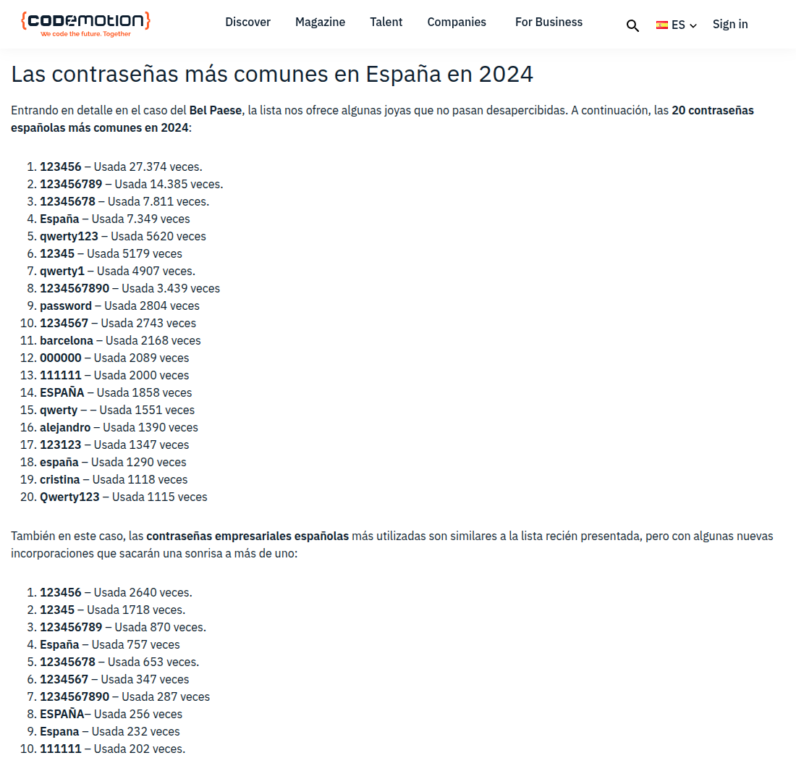
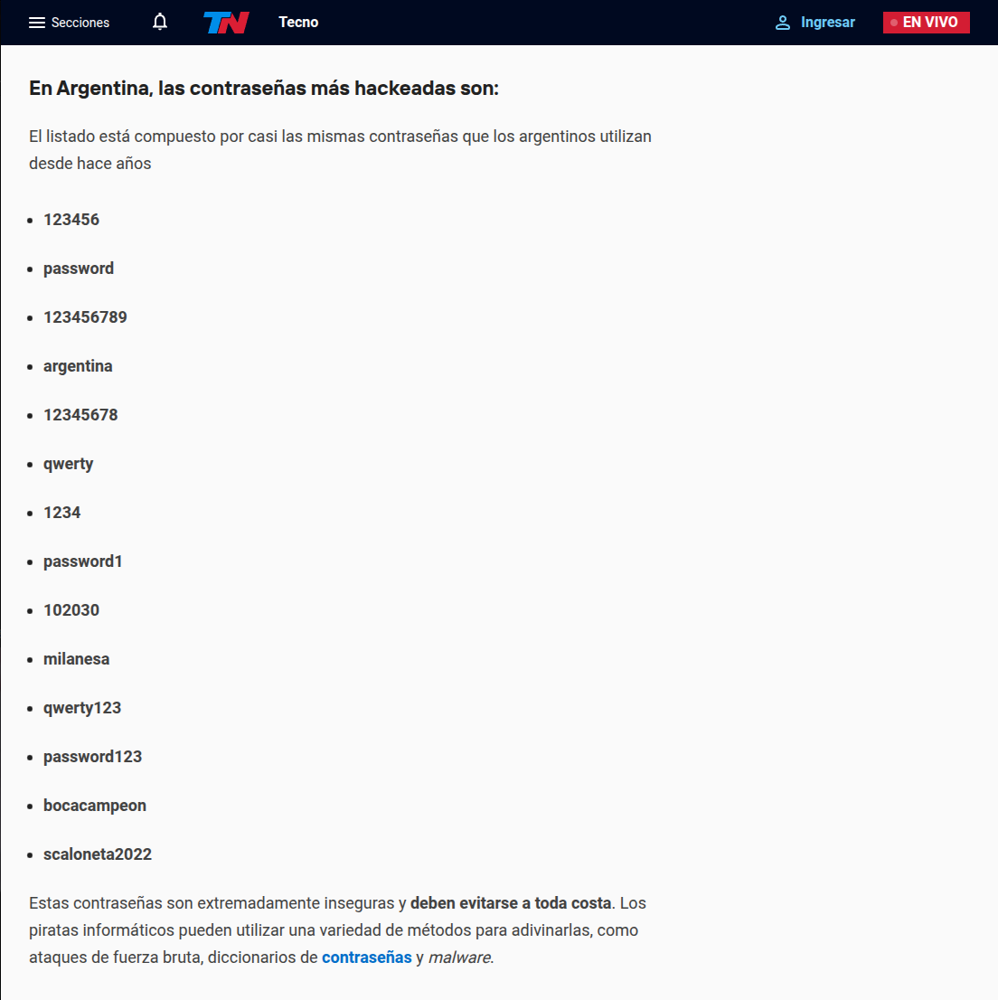
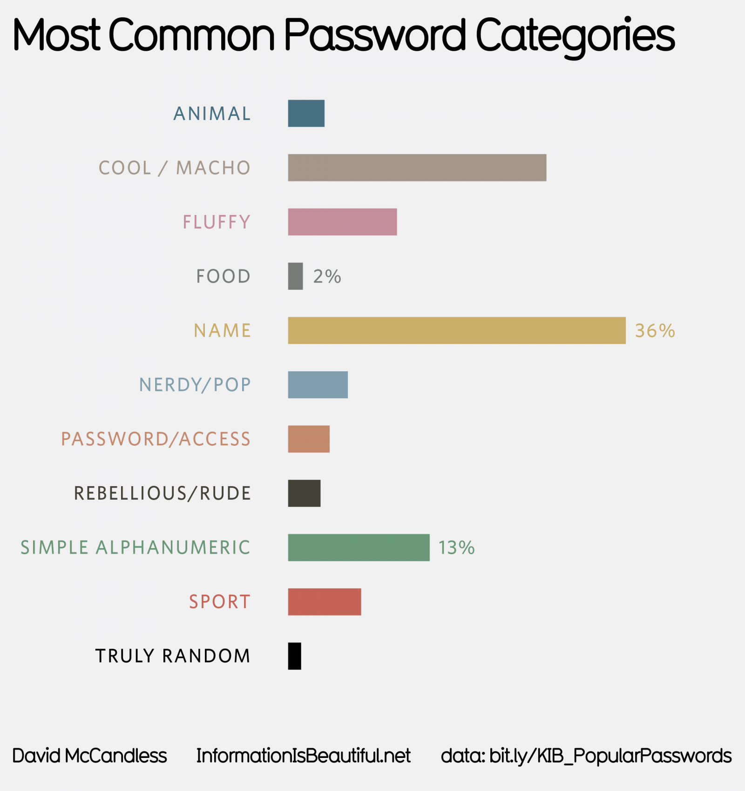
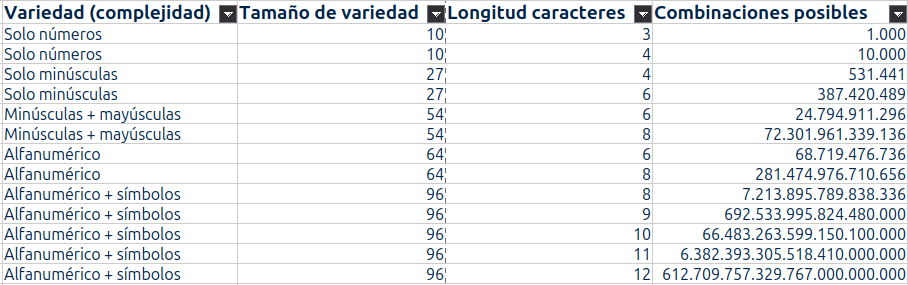
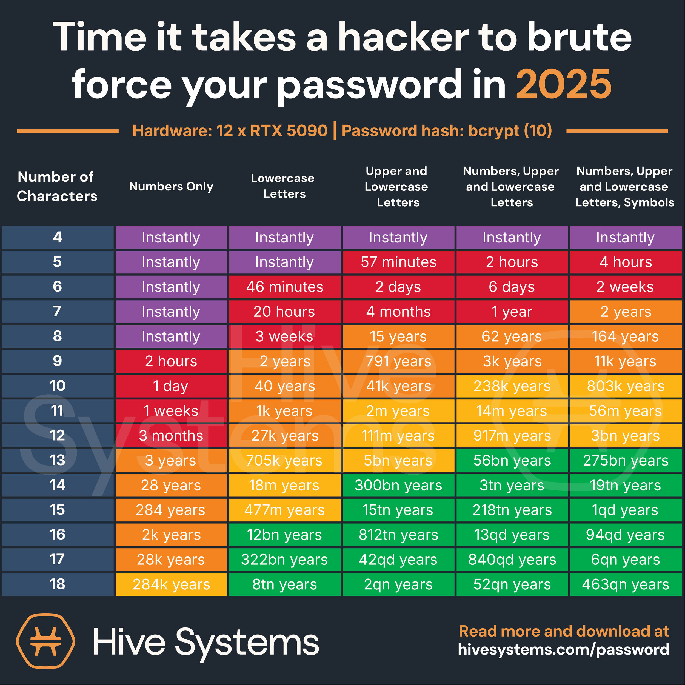
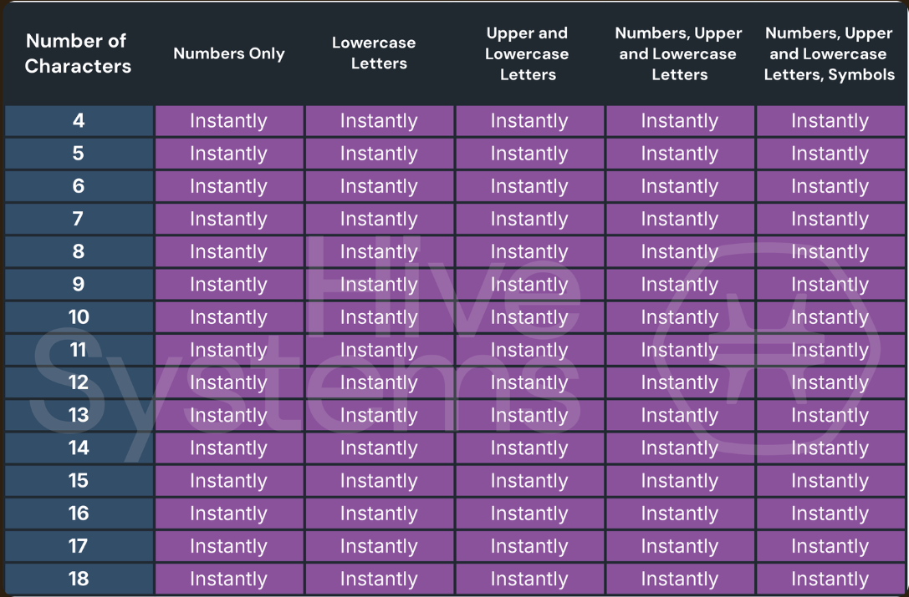
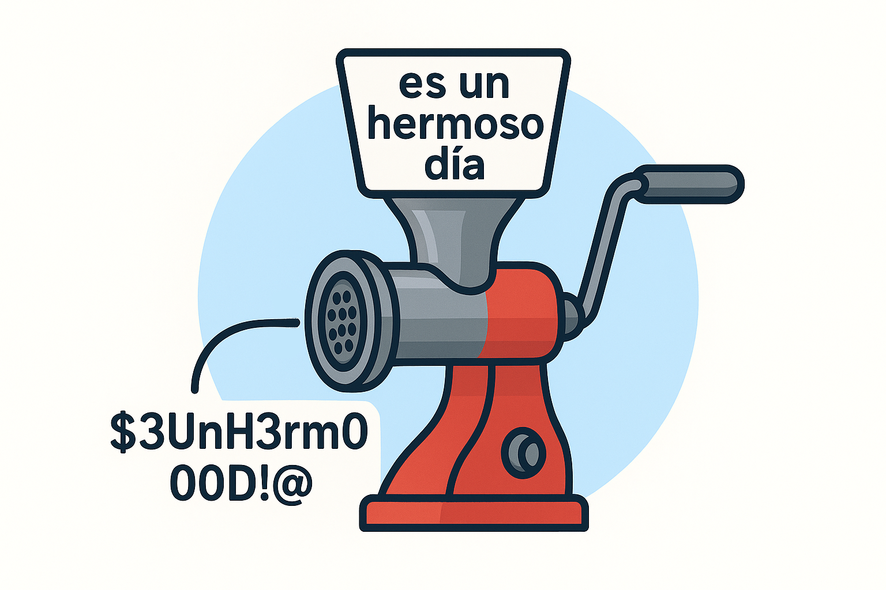

## Resumen

Actividad práctica orientada a comprender la importancia de las contraseñas y desarrollar estrategias para crear claves más seguras y fáciles de recordar.

A partir de ejemplos reales, estadísticas de contraseñas, contraseñas filtradas y ejercicios de construcción de contraseñas, se introducen conceptos relacionados con autenticación, ataques de fuerza bruta y protección de cuentas digitales.

La propuesta combina reflexión, análisis de casos cotidianos y una actividad práctica donde cada participante construye una contraseña utilizando una metodología sencilla basada en frases personales.

## Objetivos

- Comprender qué es una contraseña y cuál es su función.
- Reconocer riesgos asociados al uso de contraseñas débiles o reutilizadas.
- Identificar patrones frecuentes en las contraseñas más utilizadas.
- Comprender de forma simplificada el concepto de fuerza bruta.
- Reflexionar sobre filtraciones de datos y exposición de credenciales.
- Construir contraseñas más robustas utilizando una metodología sencilla.
- Promover buenas prácticas para la protección de cuentas digitales.

## Materiales necesarios

- Papel y lápiz para cada participante.
- Computadora y acceso a Internet.
- Proyector (opcional).

## Guía para quien coordina

La actividad combina momentos expositivos breves con instancias prácticas de participación.

Se recomienda comenzar recuperando experiencias de los participantes sobre el uso de contraseñas en el día a día. Muchas personas utilizan contraseñas en servicios bancarios, correo electrónico, redes sociales, aplicaciones de mensajería o dispositivos móviles, por lo que suele ser un tema cercano y familiar.

No es necesario profundizar en aspectos técnicos complejos. El objetivo principal es comprender por qué algunas contraseñas resultan más seguras que otras y cómo adoptar hábitos que reduzcan riesgos de acceso no autorizado.

## Introducción: ¿Qué es una contraseña?

Una contraseña es una información secreta utilizada para verificar la identidad de una persona y permitir el acceso a recursos, servicios o información protegida.

Las contraseñas forman parte de nuestra vida diaria. Las utilizamos para acceder al correo electrónico, redes sociales, servicios bancarios, dispositivos móviles y muchas otras aplicaciones.

Aunque suelen parecer simples, constituyen una de las principales barreras de protección de nuestra identidad digital.

## Desarrollo de la actividad

### ¿Qué contraseñas utilizan las personas?

Se presentan ejemplos de contraseñas frecuentes obtenidas a partir de estudios y filtraciones públicas.

El objetivo es identificar patrones comunes como secuencias numéricas, nombres propios, fechas importantes o palabras fáciles de recordar.

**Contraseñas más hackeadas mundialmente (2024):**

**Contraseñas más hackeadas en España (2024):**

**Contraseñas más hackeadas en Argentina (2024):**

**Las 500 contraseñas más utilizadas en el mundo:**

[Information is Beautiful - Most Common Passwords](https://informationisbeautiful.net/visualizations/top-500-passwords-visualized/)

### ¿Qué nos muestran estas tablas?

Al comparar los distintos rankings es posible observar que muchas personas utilizan contraseñas similares independientemente del país.

Entre los ejemplos más frecuentes aparecen:

- Nombres propios
- Secuencias numéricas simples
- Palabras comunes del idioma
- Equipos deportivos
- Fechas significativas
- Combinaciones muy cortas o fáciles de recordar

La repetición de estos patrones permite reflexionar sobre una característica importante: las contraseñas más fáciles de recordar suelen ser también las primeras que un atacante intentará adivinar.

Por este motivo, utilizar palabras conocidas, nombres de familiares, fechas de nacimiento o secuencias simples puede aumentar significativamente el riesgo de acceso no autorizado a una cuenta.

Estas observaciones sirven como punto de partida para comprender cómo funcionan algunos ataques orientados a descubrir contraseñas.

### ¿Qué tan difícil es adivinar una contraseña?

Una de las formas más conocidas de intentar descubrir contraseñas es mediante ataques de **fuerza bruta**.

En este tipo de ataques, un sistema prueba automáticamente una gran cantidad de combinaciones posibles hasta encontrar la contraseña correcta. Aunque la idea parece simple, la cantidad de intentos necesarios puede crecer muy rápidamente.

Para comprender este fenómeno, se analiza cómo varía la cantidad de combinaciones posibles según dos factores:

* La longitud de la contraseña.
* La variedad de caracteres utilizados.

A medida que aumenta la cantidad de caracteres disponibles (letras, números y símbolos) y la longitud de la contraseña, el número de combinaciones posibles crece de forma exponencial.

La siguiente tabla muestra algunos ejemplos:

### ¿Qué podemos observar?

La tabla permite identificar algunas ideas importantes:

* Agregar uno o dos caracteres puede aumentar considerablemente la cantidad de combinaciones posibles.
* Utilizar únicamente números genera muchas menos combinaciones que combinar letras, números y símbolos.
* Las contraseñas cortas suelen ser más fáciles de adivinar que las largas.
* La longitud suele aportar más seguridad que realizar pequeñas modificaciones sobre una contraseña corta.

Por este motivo, una contraseña como:

> perro123

puede resultar más sencilla de descubrir que una contraseña más extensa formada a partir de una frase significativa para la persona usuaria.

La intención de este ejercicio no es memorizar fórmulas matemáticas, sino comprender que pequeñas diferencias en la longitud y complejidad de una contraseña pueden generar diferencias muy grandes en la cantidad de intentos necesarios para adivinarla.

### Filtraciones de datos y exposición de credenciales

Además de intentar adivinar contraseñas mediante fuerza bruta, los atacantes también pueden aprovechar filtraciones de datos ocurridas en servicios y plataformas en línea.

A lo largo de los años se han producido numerosas filtraciones que expusieron direcciones de correo electrónico, contraseñas y otros datos personales de millones de personas alrededor del mundo.

Cuando una contraseña forma parte de una filtración, su complejidad o longitud pueden dejar de ser relevantes. Si un atacante ya conoce la contraseña, el acceso puede resultar inmediato.

La siguiente tabla muestra ejemplos de tiempos estimados de descubrimiento para contraseñas que ya forman parte de bases de datos filtradas:

### Verificando si una cuenta aparece en filtraciones conocidas

El sitio Have I Been Pwned sirve para consultar si una dirección de correo electrónico aparece asociada a filtraciones de datos conocidas.

Los participantes pueden ingresar su dirección de correo electrónico y verificar si fue incluida en alguna de las bases de datos públicas recopiladas por el servicio.

[Have I Been Pwned](https://haveibeenpwned.com/)

Have I Been Pwned fue creado por el especialista en seguridad Troy Hunt y mantiene una base de datos construida a partir de filtraciones que se han hecho públicas a lo largo de los años. Estas filtraciones provienen de distintas fuentes, como reportes de incidentes de seguridad, bases de datos difundidas en foros o sitios especializados, y conjuntos de datos cuya autenticidad ha sido verificada por la comunidad de seguridad.

La herramienta no solicita contraseñas ni permite acceder a cuentas. Su función es informar si una dirección de correo electrónico aparece relacionada con incidentes de seguridad previamente reportados.

Si bien ningún servicio puede garantizar una cobertura absoluta de todas las filtraciones existentes, Have I Been Pwned es ampliamente utilizado por profesionales, organizaciones y equipos de seguridad de todo el mundo. Su información se considera una referencia confiable para detectar exposiciones conocidas, aunque la ausencia de resultados no garantiza que una cuenta nunca haya estado involucrada en una filtración.

### ¿Por qué no conviene reutilizar contraseñas?

A lo largo de la actividad se observaron distintos riesgos asociados al uso de contraseñas: algunas pueden ser fáciles de adivinar, otras pueden verse comprometidas mediante ataques automatizados y, en algunos casos, pueden quedar expuestas por una filtración de datos.

Cuando una misma contraseña se utiliza en varios servicios, una filtración en uno de ellos puede afectar a todos los demás. Si esa contraseña queda expuesta, un atacante podría intentar utilizarla para acceder a otras cuentas asociadas al mismo correo electrónico.

Este riesgo existe incluso cuando la contraseña es larga o difícil de adivinar. Una contraseña robusta deja de ser efectiva si ya fue expuesta públicamente.

Por este motivo, se recomienda utilizar contraseñas diferentes para los servicios más importantes y cambiar aquellas que hayan aparecido en filtraciones conocidas.

Have I Been Pwned muestra que la seguridad de una cuenta no depende únicamente de la fortaleza de una contraseña, sino también de cómo se administra y protege a lo largo del tiempo.

### Actividad práctica: Fábrica de Contraseñas

La actividad propone construir una contraseña a partir de una frase significativa para cada participante.

El objetivo es generar contraseñas más difíciles de adivinar sin depender únicamente de palabras aisladas o secuencias fáciles de recordar.

**Paso 1: Elegir una frase**

Cada participante piensa una frase sencilla que resulte fácil de recordar.

Por ejemplo:

> Hoy tomé mate con mis amigos en la plaza.

No es necesario utilizar esta frase. Puede tratarse de una experiencia personal, una canción, una película o cualquier frase que tenga algún significado especial y sea fácil de recordar.

**Paso 2: Tomar las iniciales**

Se toman las iniciales de cada palabra de la frase.

Por ejemplo:

> Htmcmaelp

**Paso 3: Incorporar mayúsculas**

Se seleccionan algunas letras para escribirlas en mayúscula.

Por ejemplo:

> HtMcmaelP

**Paso 4: Reemplazar letras por otros caracteres**

Se sustituyen algunas letras por números o símbolos fáciles de recordar.

Por ejemplo:

> HtMcm@elP

**Paso 5: Agregar números significativos**

Se incorporan uno o más números que resulten fáciles de recordar para la persona.

Por ejemplo:

> HtMcm@elP25

**Paso 6: Agregar símbolos adicionales**

Se añade uno o más símbolos para incrementar la variedad de caracteres utilizados.

Por ejemplo:

> Htmcm@elP#25!

**Resultado final**

La contraseña obtenida:

> Htmcm@elP#25!

resulta más extensa y difícil de adivinar que una palabra común, pero continúa siendo posible reconstruirla recordando la frase original y recorriendo los pasos en sentido inverso.

## Recursos complementarios

## Recursos complementarios

### Caso RockYou (2009)

Una de las filtraciones de contraseñas más conocidas ocurrió en 2009 cuando la empresa RockYou sufrió una brecha de seguridad que expuso millones de credenciales.

La filtración permitió analizar qué contraseñas utilizaban realmente las personas. Muchas de las más frecuentes eran extremadamente simples, como:

* 123456
* password
* iloveyou
* princess

Este incidente suele utilizarse para explicar por qué existen tablas de contraseñas frecuentes y cómo funcionan los ataques basados en diccionarios de palabras conocidas.

Más información:

- [Wikipedia - RockYou](https://en.wikipedia.org/wiki/RockYou)
- [Computer World - RockYou](https://www.computerworld.com/article/1557435/rockyou-hack-exposes-names-passwords-of-30m-accounts.html)

### Mercado Libre y Mercado Pago (2022)

En 2022, Mercado Libre confirmó un acceso no autorizado que afectó datos asociados a aproximadamente 300.000 usuarios y parte de su código fuente.

Aunque la empresa informó que no encontró evidencia de compromiso de contraseñas ni información financiera, el caso permite reflexionar sobre cómo incluso plataformas ampliamente utilizadas pueden verse afectadas por incidentes de seguridad.

La noticia también resulta útil para introducir conceptos relacionados con filtraciones de datos, exposición de información y medidas de protección de cuentas.

Más información:

- [MercadoLibre - Comunicado](https://www.mercadolibre.com.ar/institucional/comunicamos/noticias/comunicado-mercado-libre-seguridad)
- [Infobae - Filtración MercadoLibre y MercadoPago](https://www.infobae.com/economia/2022/03/07/filtracion-masiva-en-mercado-libre-acceden-sin-autorizacion-a-los-datos-de-300000-usuarios/)

## Preguntas frecuentes

> **¿Qué características debería tener una buena contraseña?**
>
> No existe una única receta, pero en general se recomienda utilizar contraseñas suficientemente largas, difíciles de adivinar y diferentes para cada servicio importante.
>
> Las contraseñas basadas en frases significativas suelen resultar más fáciles de recordar que aquellas compuestas por caracteres aleatorios.

> **¿Es más importante la longitud o la complejidad?**
>
> Ambos factores contribuyen a la seguridad de una contraseña. Sin embargo, aumentar la longitud suele generar un impacto mayor en la cantidad de combinaciones posibles que realizar pequeñas modificaciones sobre una contraseña corta.

> **¿Por qué no conviene utilizar fechas de nacimiento o nombres propios?**
>
> Este tipo de información suele ser conocida por familiares, amistades o personas que interactúan con nosotros en redes sociales. Además, aparece con frecuencia en ataques automatizados y diccionarios utilizados para adivinar contraseñas.

> **¿Qué ocurre si mi correo electrónico aparece en una filtración?**
>
> La aparición en una filtración no implica necesariamente que una cuenta haya sido comprometida, pero indica que la dirección de correo electrónico estuvo asociada a un incidente de seguridad conocido.
>
> Se recomienda revisar las cuentas afectadas y actualizar las contraseñas si continúan en uso.

> **¿Qué es Have I Been Pwned?**
>
> Es una herramienta que permite consultar si una dirección de correo electrónico aparece en bases de datos provenientes de filtraciones conocidas.
>
> Su objetivo es ayudar a identificar posibles exposiciones de cuentas y promover medidas preventivas.

> **¿Qué es la autenticación multifactor (MFA)?**
>
> Es un mecanismo de seguridad que solicita una verificación adicional además de la contraseña.
>
> Por ejemplo, puede requerir un código enviado al teléfono móvil, una aplicación de autenticación o una llave física de seguridad.

> **¿La autenticación multifactor reemplaza a las contraseñas?**
>
> Generalmente no. En la mayoría de los servicios actúa como una capa adicional de protección que complementa a la contraseña.

> **¿Qué es un gestor de contraseñas?**
>
> Es una herramienta diseñada para almacenar y administrar contraseñas de forma segura.
>
> Permite utilizar contraseñas diferentes para cada servicio sin necesidad de recordarlas todas.

> **¿Es seguro guardar contraseñas en el navegador?**
>
> Los navegadores modernos incorporan mecanismos de protección para almacenar contraseñas. Sin embargo, la seguridad dependerá también de las medidas de protección del dispositivo y de la cuenta utilizada.
>
> Para quienes administran muchas cuentas, un gestor de contraseñas especializado suele ofrecer funciones adicionales de organización y seguridad.

> **¿Cada cuánto tiempo debo cambiar mis contraseñas?**
>
> Actualmente se recomienda cambiar una contraseña cuando existe evidencia o sospecha de compromiso, cuando aparece en una filtración o cuando el servicio lo solicita por motivos de seguridad.
>
> Cambiar contraseñas frecuentemente sin una razón específica no siempre aporta beneficios si ya se utilizan contraseñas robustas y autenticación multifactor.

> **¿Qué hago si olvido una contraseña?**
>
> La mayoría de los servicios ofrecen mecanismos de recuperación mediante correo electrónico, teléfono móvil u otros métodos de verificación de identidad.
>
> Mantener actualizados los datos de recuperación facilita el acceso a las cuentas en caso de olvido.

> **¿Las huellas digitales o el reconocimiento facial reemplazan las contraseñas?**
>
> En muchos dispositivos, las huellas digitales y el reconocimiento facial permiten acceder de forma más rápida y cómoda a una cuenta o dispositivo.
>
> Sin embargo, estos mecanismos suelen complementar a las contraseñas en lugar de reemplazarlas completamente. En la mayoría de los casos, la contraseña continúa siendo necesaria para configurar el dispositivo, recuperar el acceso a una cuenta, realizar cambios de seguridad o verificar la identidad de la persona usuaria.
>
> Por este motivo, una contraseña robusta sigue siendo una de las principales herramientas para proteger cuentas y servicios digitales, incluso cuando se utilizan métodos biométricos como huellas digitales o reconocimiento facial.
