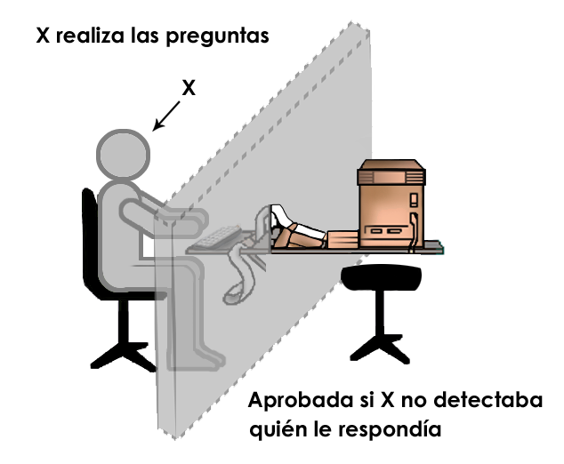
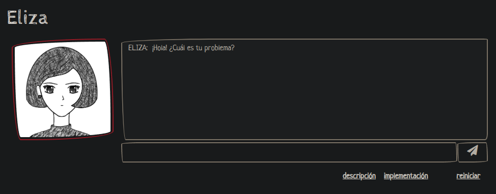
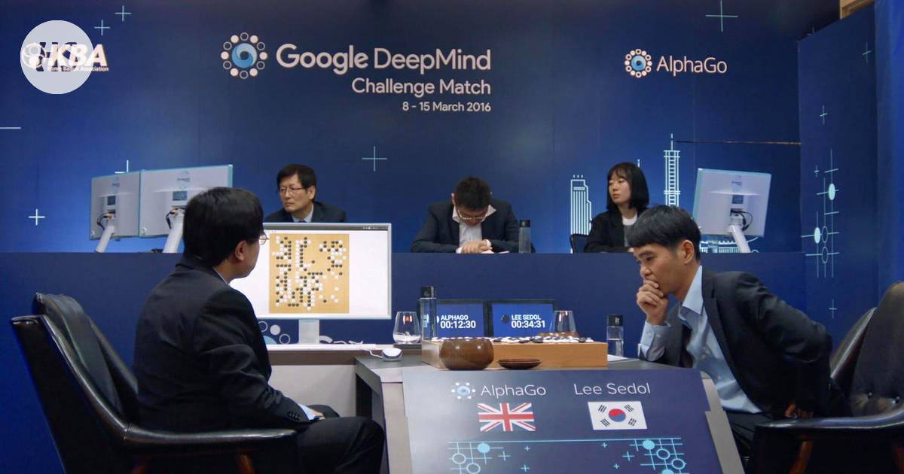
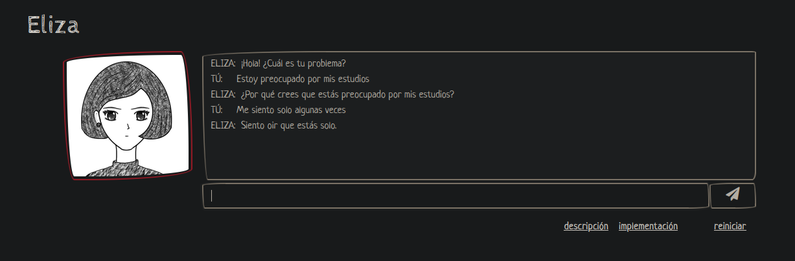
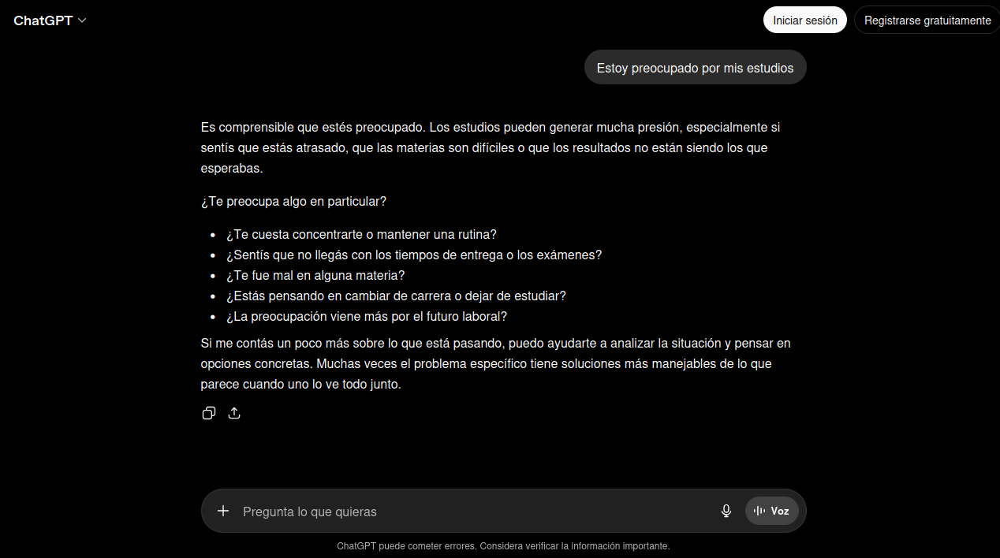
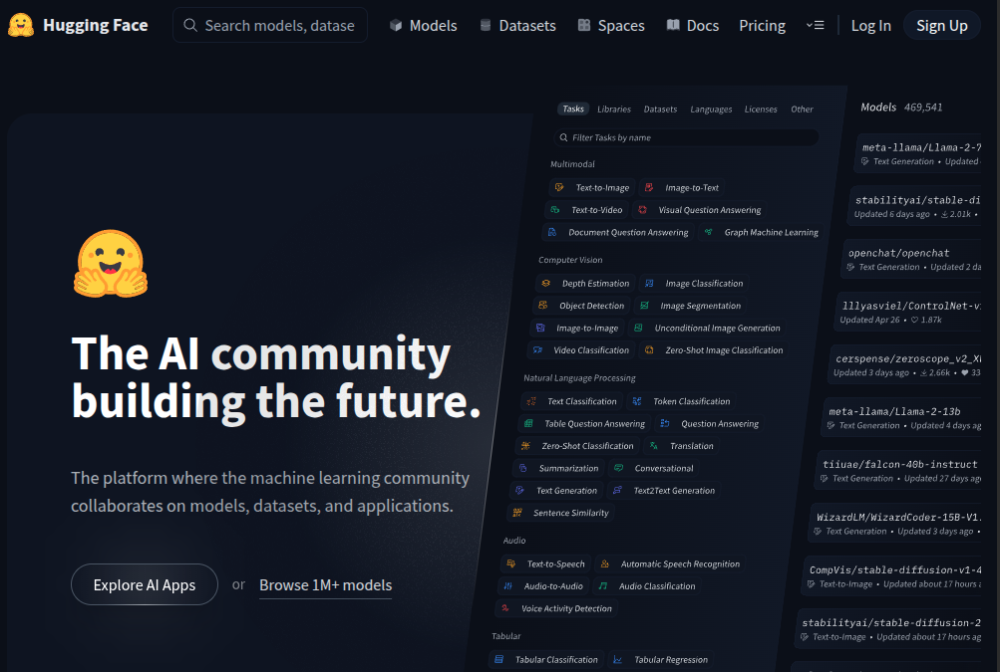

## Resumen

Actividad participativa orientada a explorar qué es la inteligencia artificial, cómo ha evolucionado a lo largo del tiempo y cuáles son algunas de sus aplicaciones actuales.

A través de ejemplos históricos, demostraciones prácticas y el uso de herramientas accesibles desde computadoras o teléfonos celulares, se introducen conceptos relacionados con modelos de lenguaje, generación de contenido, reconocimiento de patrones y uso responsable de sistemas de inteligencia artificial.

La propuesta combina explicaciones breves, intercambio de experiencias, experimentación con herramientas reales y reflexión crítica sobre las posibilidades y limitaciones de estas tecnologías.

## Objetivos

- Comprender qué entendemos por inteligencia artificial.
- Conocer algunos hitos históricos relevantes en la evolución de la IA.
- Diferenciar conceptos como predicción de texto, aprendizaje automático e inteligencia artificial generativa.
- Explorar herramientas de inteligencia artificial mediante experiencias prácticas.
- Observar la evolución de los sistemas conversacionales.
- Reconocer que los sistemas de IA funcionan a partir de probabilidades y patrones aprendidos.
- Identificar limitaciones, errores y alucinaciones generadas por estos sistemas.
- Promover un uso crítico, responsable y seguro de las herramientas de inteligencia artificial.

## Materiales necesarios

- Computadora, tablet o teléfono celular con acceso a Internet.
- Proyector o pantalla (opcional).
- Navegador web actualizado.
- Acceso a herramientas de IA para demostraciones y ejercicios prácticos.

## Guía para quien coordina

La actividad está pensada como una experiencia de exploración guiada y conversación grupal.

No es necesario profundizar en aspectos matemáticos o técnicos. Se recomienda utilizar ejemplos concretos, situaciones cotidianas y demostraciones prácticas para favorecer la comprensión. Los conceptos técnicos pueden introducirse de forma simplificada y adaptarse al nivel de conocimiento e interés del grupo.

La participación de los asistentes es un componente central de la propuesta. Se sugiere promover preguntas, intercambios de experiencias y pequeños ejercicios utilizando herramientas reales de inteligencia artificial.

Durante la actividad resulta importante destacar tanto las capacidades como las limitaciones de estos sistemas, fomentando una actitud crítica frente a los resultados generados.

El objetivo no es formar especialistas en inteligencia artificial, sino brindar herramientas que ayuden a comprender mejor tecnologías que cada vez tienen mayor presencia en la vida cotidiana.

## Introducción: ¿Qué entendemos por Inteligencia Artificial?

La expresión "inteligencia artificial" suele utilizarse para describir tecnologías muy diferentes entre sí. Algunas permiten reconocer imágenes, otras pueden jugar videojuegos o juegos de estrategia, mientras que otras generan texto, imágenes, audio o video.

Antes de abordar herramientas actuales como ChatGPT, resulta útil observar que muchas de las preguntas que hoy nos hacemos sobre la inteligencia artificial tienen varias décadas de historia:

- ¿Puede una computadora conversar?
- ¿Puede resolver problemas complejos?
- ¿Puede aprender?
- ¿Puede crear contenido?
- ¿Puede equivocarse?

Estas preguntas sirven como punto de partida para explorar cómo evolucionaron estas tecnologías y qué pueden hacer actualmente.

## Breve recorrido histórico

La actividad comienza explorando algunas preguntas que acompañan el desarrollo de la inteligencia artificial desde hace décadas.

### ¿Puede una computadora pensar?

En 1950, Alan Turing publicó un trabajo en el que planteó una pregunta que continúa siendo debatida en la actualidad: ¿puede una máquina pensar?

Como forma de abordar esta cuestión, propuso una prueba conocida posteriormente como Test de Turing. En esta prueba, una persona mantiene una conversación escrita con otra persona y con una computadora sin saber cuál es cuál. Si la computadora logra responder de manera tal que resulte difícil distinguirla de un ser humano, podría considerarse que exhibe un comportamiento inteligente en ese contexto.

Aunque el Test de Turing sigue siendo objeto de debate, tuvo una gran influencia en el desarrollo de la inteligencia artificial y en la forma de pensar la relación entre personas y máquinas.

### ¿Puede una computadora conversar?

Años más tarde surgieron programas como ELIZA (1966), desarrollado por el investigador Joseph Weizenbaum en el MIT. ELIZA es considerado uno de los primeros sistemas capaces de mantener conversaciones simples con personas.

Su funcionamiento era muy diferente al de los asistentes actuales. ELIZA no comprendía realmente el significado de las frases ni aprendía de la conversación. En cambio, utilizaba reglas predefinidas para identificar ciertas palabras o expresiones y generar respuestas a partir de plantillas.

Una de sus versiones más conocidas simulaba el comportamiento de un psicoterapeuta. Por ejemplo, si una persona escribía "Estoy preocupado por mis estudios", ELIZA podía responder con preguntas como "¿Por qué estás preocupado por tus estudios?", o "Cuéntame más sobre tus estudios". Este tipo de respuestas daba continuidad al diálogo sin necesidad de comprender el contenido de la conversación.

A pesar de sus limitaciones, muchas personas que interactuaron con ELIZA tuvieron la sensación de estar conversando con alguien que las entendía. Este fenómeno mostró que los seres humanos tendemos a atribuir intención, comprensión o inteligencia a sistemas que producen respuestas coherentes en una conversación.

Durante la actividad se pueden observar ejemplos de conversaciones con ELIZA y explorar una versión en español. Las imágenes adjuntas muestran tanto el resultado de una conversación como la interfaz de línea de comandos utilizada para interactuar con el programa, permitiendo apreciar cómo eran este tipo de sistemas décadas antes de la aparición de los modelos de lenguaje actuales.

### ¿Puede una computadora jugar?

Durante muchos años, los juegos de estrategia fueron utilizados como desafíos para evaluar las capacidades de las computadoras.

En 1997, Deep Blue derrotó al campeón mundial de ajedrez Garry Kasparov. Este logro se apoyó principalmente en la capacidad de cálculo de la computadora. Deep Blue analizaba millones de posiciones por segundo y evaluaba cuál era el mejor movimiento posible utilizando reglas diseñadas por expertos en ajedrez y programación.

Este enfoque puede compararse con una persona que intenta resolver un problema revisando rápidamente una enorme cantidad de opciones antes de tomar una decisión. La fortaleza de Deep Blue no estaba en aprender por sí mismo, sino en su capacidad para calcular y explorar muchas jugadas posibles en muy poco tiempo.

Años después, AlphaGo logró derrotar a Lee Sedol, uno de los mejores jugadores del mundo en Go. Este juego presenta un desafío mucho mayor para las computadoras porque la cantidad de movimientos posibles es tan grande que resulta imposible analizar todas las combinaciones de manera exhaustiva.

Para enfrentar este problema se produjo un cambio importante en las tecnologías utilizadas. En lugar de depender principalmente de reglas programadas por personas y de una búsqueda masiva de movimientos, AlphaGo incorporó técnicas de aprendizaje automático y redes neuronales.

Estas redes fueron entrenadas observando miles de partidas jugadas por personas expertas y posteriormente continuaron mejorando mediante la práctica contra sí mismas. De esta manera, el sistema aprendió a reconocer patrones y a identificar qué movimientos suelen ser más prometedores en distintas situaciones. Luego continuó mejorando mediante la práctica, jugando una gran cantidad de partidas contra sí mismo.

Mientras que Deep Blue se apoyaba principalmente en la potencia de cálculo y en reglas definidas por programadores, AlphaGo combinaba cálculo con la capacidad de aprender a partir de datos y experiencia. Este cambio marcó una transición importante en la historia de la inteligencia artificial: pasar de sistemas que siguen instrucciones cuidadosamente diseñadas por humanos a sistemas capaces de aprender patrones por cuenta propia.

### ¿Puede una computadora predecir texto?

Muchas personas utilizan diariamente sistemas de predicción de texto en teléfonos celulares y aplicaciones de mensajería.

Cuando una persona comienza a escribir una frase, el sistema intenta anticipar cuál podría ser la siguiente palabra. Por ejemplo, si alguien escribe una receta que dice "Para preparar la salsa, agregar la", el sistema podría sugerir ingredientes o palabras que aparecen agrupadas frecuentemente como "crema", "receta" o "carne". Estas sugerencias se basan en patrones observados previamente y mantienen coherencia con el contexto, por lo que no propondría elementos sin relación como "zapatos" o "relojes".

Aunque estos sistemas suelen trabajar con frases cortas y sugerencias simples, muestran una idea fundamental que también aparece en tecnologías más avanzadas: utilizar información previa para estimar qué palabra tiene más probabilidades de aparecer a continuación.

### ¿Puede una computadora mantener una conversación?

Los asistentes conversacionales modernos, como ChatGPT, Gemini o Claude, utilizan modelos de lenguaje entrenados con enormes cantidades de texto.

Al igual que los sistemas de predicción de texto, estos modelos generan respuestas estimando qué palabras tienen más probabilidades de aparecer a continuación. Sin embargo, lo hacen a una escala mucho mayor y considerando el contexto completo de la conversación.

Una forma sencilla de entender este proceso es imaginar una frase incompleta como: "El cielo está muy...". A partir de los ejemplos observados durante su entrenamiento, un modelo podría considerar que palabras como "nublado", "claro" u "oscuro" tienen una alta probabilidad de aparecer a continuación. Luego selecciona una de las opciones posibles y continúa realizando nuevas predicciones palabra por palabra.

Aunque este mecanismo parece simple, cuando se aplica sobre enormes cantidades de información y con modelos de gran tamaño, permite generar textos extensos, responder preguntas, resumir documentos, traducir idiomas o mantener conversaciones relativamente fluidas.

Es importante destacar que estos sistemas no buscan información de la misma manera que una persona consulta una enciclopedia ni almacenan respuestas exactas para cada pregunta posible. En cambio, generan cada respuesta prediciendo secuencias de palabras que resultan coherentes con los patrones aprendidos durante el entrenamiento.

Esta capacidad de producir texto convincente ha dado lugar a herramientas como ChatGPT, Gemini, Claude y muchos otros asistentes conversacionales. Sin embargo, el hecho de que una respuesta suene natural o parezca razonable no garantiza que sea correcta. Los modelos pueden cometer errores, mezclar información o incluso inventar datos, un fenómeno que se analizará más adelante al abordar las limitaciones de la inteligencia artificial generativa.

## Desarrollo de la actividad

### Intercambio inicial

Se propone una conversación abierta sobre qué entienden los participantes por inteligencia artificial y qué usos conocen o han observado en su vida cotidiana.

El objetivo no es obtener respuestas correctas o incorrectas, sino identificar ideas previas, expectativas y experiencias relacionadas con estas tecnologías.

### Actividad práctica: conversando con ELIZA

Para comprender cómo eran algunos de los primeros sistemas conversacionales, se propone interactuar con una versión en español de ELIZA, un programa desarrollado en 1966 por Joseph Weizenbaum.

A diferencia de los asistentes modernos, ELIZA no comprende el significado de las frases ni genera respuestas a partir de grandes cantidades de información. Su funcionamiento se basa en reglas simples que identifican palabras o expresiones dentro de una oración y construyen respuestas utilizando plantillas predefinidas.

A pesar de estas limitaciones, muchas personas experimentan la sensación de estar manteniendo una conversación real. Este fenómeno permite reflexionar sobre cómo interpretamos las respuestas generadas por una computadora y por qué tendemos a atribuir comprensión o inteligencia a sistemas que responden de forma coherente.

Se invita a los participantes a utilizar ELIZA y observar el tipo de respuestas que produce.

Sitio utilizado durante la actividad:

[ELIZA en español](http://deixilabs.com/eliza.html)

**Propuestas de exploración:**

Puede resultar interesante que varios participantes realicen las mismas consultas y luego comparen las respuestas obtenidas.

Por ejemplo:

> Estoy preocupado por mis estudios.
> 
> Me siento solo algunas veces.
> 
> No sé si debería confiar en la inteligencia artificial.
> 
> Quiero aprender algo nuevo.
> 
> Luego se pueden discutir algunas preguntas:

- ¿Las respuestas fueron similares entre distintos participantes?
- ¿ELIZA realmente comprendió lo que se le escribió?
- ¿Qué estrategias utiliza para mantener la conversación?
- ¿En qué se diferencia de una conversación entre personas?

Esta actividad sirve como punto de partida para comparar los primeros sistemas conversacionales con herramientas actuales como ChatGPT, Gemini o Claude.

### Actividad práctica: conversando con ChatGPT

Luego de experimentar con ELIZA, se propone interactuar con un asistente conversacional moderno basado en modelos de lenguaje.

Se podrá observar y comparar las respuestas obtenidas con las generadas por ELIZA.

Al igual que en la actividad anterior, se invita a los participantes a formular preguntas y mantener una breve conversación con la herramienta.

**Propuestas de exploración:**

Puede resultar interesante que varios participantes realicen las mismas consultas y luego comparen las respuestas obtenidas.

Por ejemplo:

> Estoy preocupado por mis estudios

> Me siento solo algunas veces

> No sé si debería confiar en la inteligencia artificial

> Quiero aprender algo nuevo

Luego se pueden discutir algunas preguntas:

- ¿Las respuestas fueron similares entre distintos participantes?
- ¿Qué diferencias se observan respecto de ELIZA?
- ¿Las respuestas parecen más naturales?
- ¿La herramienta comprende realmente lo que se le pregunta?
- ¿Cómo podríamos saber si una respuesta es correcta?

Esta comparación permite observar la evolución de los sistemas conversacionales y comprender por qué los modelos de lenguaje actuales resultan mucho más convincentes que los primeros chatbots.

### Actividad práctica: generación de contenido con ChatGPT

Una de las capacidades más conocidas de los modelos de lenguaje actuales es la generación de texto.

Para explorar esta característica, se propone elegir un producto ampliamente conocido y pedir a la herramienta que genere reseñas como si hubieran sido escritas por personas usuarias.

**Parte 1: reseña positiva**

Se solicita a la inteligencia artificial que genere una reseña positiva sobre un producto ampliamente conocido por los participantes.

Por ejemplo:

> Escribí una reseña positiva sobre el <producto>. La reseña debe parecer escrita por una persona satisfecha después de varios meses de uso

**Parte 2: reseña negativa**

A continuación, se solicita una reseña negativa sobre el mismo producto.

Por ejemplo:

> Escribí una reseña negativa sobre el mismo producto. La reseña debe parecer escrita por una persona que no recomienda su compra

**Reflexión grupal**

Luego de generar ambos textos, se propone discutir:

- ¿Las reseñas parecen auténticas?
- ¿Cómo podríamos distinguir si fueron escritas por una persona o por una inteligencia artificial?
- ¿Qué impacto podrían tener este tipo de contenidos en redes sociales, tiendas en línea o plataformas de opinión?
- ¿Podrían utilizarse para manipular la percepción de un producto, servicio o empresa?
- ¿Qué riesgos existen si confiamos únicamente en comentarios publicados en Internet?

Esta actividad permite reflexionar sobre la facilidad con la que los sistemas actuales pueden generar contenido convincente y sobre la importancia de verificar la información antes de tomar decisiones basadas únicamente en opiniones encontradas en línea.

## Generación de imágenes y videos

- [Evolución de la IA - Will Smith comiendo spaghetti (Video)](https://youtube.com/shorts/7zdVCQ52kMQ?si=FX4OBzzqovB80Aop)
- [Juego corto adivina ¿Es IA o es real? (Imágenes)](https://youtube.com/shorts/oNWMHjKsqrA?si=_Bn7XSum9hCpJzGo)
- [Juego adivina el real vs. IA (Imágenes)](https://youtu.be/wppNCWCqoRs)

## IA generativa en la actualidad

Se presentan ejemplos de herramientas y plataformas utilizadas para generar texto, imágenes, audio y video.

También puede explorarse el catálogo de modelos disponibles en Hugging Face para observar la diversidad de proyectos y aplicaciones actualmente en desarrollo.

[Hugging Face](https://huggingface.co/)

## Alucinaciones, sesgos y limitaciones

A pesar de sus capacidades, los sistemas de inteligencia artificial actuales presentan limitaciones importantes que deben ser consideradas al utilizar sus respuestas.

Una de las más conocidas es el fenómeno de las **alucinaciones**. Se denomina así a las respuestas incorrectas, inventadas o engañosas que pueden ser generadas por la inteligencia artificial y presentadas con aparente seguridad.

Durante las actividades realizadas, los participantes pudieron observar que una respuesta bien redactada no necesariamente es una respuesta correcta. Los modelos de lenguaje generan texto a partir de patrones y probabilidades aprendidas durante el entrenamiento, por lo que no verifican automáticamente la veracidad de cada afirmación que producen.

Esto puede dar lugar a situaciones como:

- Inventar datos, nombres, fechas o referencias inexistentes.
- Mezclar información correcta con información incorrecta.
- Presentar conclusiones erróneas con un lenguaje convincente.
- Omitir información relevante para responder una pregunta.

Otra limitación importante es la presencia de **sesgos** (bias). Como estos sistemas son entrenados con grandes cantidades de información producida por personas, pueden reproducir prejuicios, estereotipos o desigualdades presentes en esos datos. Diversas investigaciones han demostrado que estos sesgos pueden aparecer en respuestas relacionadas con género, origen, edad, profesión u otros aspectos sociales.

Por este motivo, es importante comprender que estos sistemas no "saben" o "entienden" la información de la misma manera que una persona. Su funcionamiento se basa en estimar qué palabras tienen mayor probabilidad de aparecer a continuación dentro de un contexto determinado.

En ocasiones, cuando una respuesta es incorrecta, la herramienta puede insistir en su resultado inicial o generar nuevas explicaciones para justificarlo. Esto puede generar una falsa sensación de confianza si no se contrastan los resultados con otras fuentes o métodos de verificación.

Por estas razones, se recomienda utilizar la inteligencia artificial como una herramienta de apoyo y no como una autoridad infalible. Las respuestas obtenidas deben ser revisadas, verificadas y complementadas con otras fuentes de información, especialmente cuando se trata de temas importantes relacionados con salud, educación, finanzas, aspectos legales o seguridad.

Comprender estas **limitaciones** es tan importante como conocer las capacidades de la inteligencia artificial. Un uso responsable implica aprovechar sus ventajas sin asumir que todas sus respuestas son necesariamente correctas.

## Cómo obtener mejores respuestas

- Ser claro: escribir frases completas
- Lenguaje simple: palabras cortas
- Dar contexto: explicar qué se busca (tema, estilo, nivel de dificultad, etc.)
- Evitar ambigüedades: palabras muy generales dan respuestas vagas
- Palabras clave: usar términos importantes en la consigna
- Pedir ejemplos: o tablas comparativas que ayuden a visualizar y verificar la respuesta
- Iterar: si la respuesta no es satisfactoria, ajustar la consulta

## Uso responsable

- No compartir información sensible o privada.
- Verificar información importante utilizando fuentes adicionales.
- Comprender que la IA puede equivocarse, alucinar o presentar sesgos.
- Utilizar la IA como herramienta de apoyo y no como reemplazo del criterio humano.
- Formular consultas claras y específicas para obtener mejores resultados.

## Recursos complementarios

- [Medium – How large language models work](https://medium.com/data-science-at-microsoft/how-large-language-models-work-91c362f5b78f)
- [LLM Visualization](https://bbycroft.net/llm)
- [Wiki – Modelo Extenso de Lenguaje (LLM)](https://es.wikipedia.org/wiki/Modelo_extenso_de_lenguaje)

## Preguntas frecuentes

> **¿ChatGPT es lo mismo que la inteligencia artificial?**
>
> No. ChatGPT es una herramienta específica basada en un modelo de lenguaje. La inteligencia artificial es un campo mucho más amplio que incluye sistemas de visión por computadora, reconocimiento de voz, recomendación de contenidos, robótica, videojuegos, diagnóstico médico y muchas otras aplicaciones.

> **¿La inteligencia artificial piensa como una persona?**
>
> No. Aunque algunos sistemas pueden producir respuestas que parecen inteligentes, no piensan ni comprenden el mundo de la misma manera que las personas.
>
> Los modelos de lenguaje generan respuestas a partir de patrones aprendidos durante su entrenamiento y no poseen conciencia, emociones o experiencias propias.

> **¿La inteligencia artificial aprende mientras converso con ella?**
>
> Depende de la herramienta utilizada. En general, los modelos ya fueron entrenados antes de que las personas los utilicen. La conversación puede utilizarse para mejorar futuros sistemas si la empresa así lo establece en sus políticas, pero normalmente el modelo no aprende instantáneamente de cada conversación individual.
> 
> Algunas herramientas incorporan funciones de memoria que permiten recordar información o preferencias asociadas a una cuenta. Esto puede facilitar futuras consultas y generar respuestas más personalizadas, aunque no implica que el modelo aprenda o modifique su entrenamiento a partir de cada conversación individual.

> **¿La inteligencia artificial tiene emociones o sentimientos?**
>
> No. Los sistemas actuales pueden generar respuestas que parecen expresar emociones o empatía, pero no experimentan sentimientos ni estados emocionales.
>
> Cuando una inteligencia artificial escribe frases como "entiendo cómo te sientes" o "lamento que estés pasando por esta situación", está generando texto que imita formas habituales de comunicación humana aprendidas durante su entrenamiento.

> **¿La inteligencia artificial puede ser empática?**
>
> Puede producir respuestas que resulten empáticas o reconfortantes para las personas, pero no experimenta empatía de la misma forma que un ser humano.
>
> La empatía que percibimos en una conversación con una IA surge de patrones de lenguaje aprendidos a partir de textos escritos por personas.

> **¿Puede una inteligencia artificial reemplazar a un médico o a un psicólogo?**
>
> No. Aunque algunas herramientas pueden proporcionar información, orientación general o ayudar a organizar ideas, no reemplazan la formación profesional, la experiencia clínica ni el criterio humano.
>
> En temas relacionados con la salud física o mental, la inteligencia artificial debe considerarse una herramienta de apoyo y no un sustituto de la atención brindada por profesionales capacitados.

> **¿Qué es un modelo de lenguaje?**
>
> Un modelo de lenguaje es un sistema de inteligencia artificial entrenado para reconocer patrones en grandes cantidades de texto y predecir qué palabras tienen más probabilidades de aparecer a continuación.
>
> Herramientas como ChatGPT, Gemini o Claude utilizan este tipo de modelos para responder preguntas, resumir información, traducir idiomas o mantener conversaciones.

> **¿Qué es una alucinación de la inteligencia artificial?**
>
> Se denomina alucinación a una respuesta incorrecta, inventada o engañosa presentada como si fuera verdadera.
>
> Las alucinaciones pueden incluir datos inexistentes, referencias inventadas, errores de interpretación o conclusiones incorrectas expresadas con aparente seguridad.

> **¿Qué es un sesgo (bias)?**
>
> Un sesgo es una tendencia sistemática que puede influir en los resultados producidos por una inteligencia artificial.
>
> Como estos sistemas aprenden a partir de información generada por personas, pueden reproducir prejuicios, estereotipos o desigualdades presentes en los datos utilizados durante su entrenamiento.

> **¿La inteligencia artificial siempre dice la verdad?**
>
> No. Una respuesta puede parecer convincente y estar bien redactada, pero aun así contener errores o información falsa.
>
> Por este motivo es importante contrastar la información con otras fuentes y mantener una actitud crítica frente a los resultados generados.

> **¿Cuánta inteligencia artificial utilizamos en lo cotidiano?**
>
> Muchas personas utilizan algún tipo de inteligencia artificial todos los días sin darse cuenta.
>
> Algunos ejemplos son:
>
> * Recomendaciones de videos, películas o música.
> * Filtros de correo no deseado.
> * Predicción de texto en teléfonos celulares.
> * Sistemas de navegación y rutas.
> * Traducción automática.
> * Reconocimiento facial o de imágenes.
> * Asistentes virtuales y chatbots.

> **¿Cuánta inteligencia artificial se utiliza actualmente en el mundo?**
>
> La inteligencia artificial forma parte de una gran cantidad de servicios digitales utilizados diariamente por millones de personas y organizaciones.
>
> Se emplea en áreas tan diversas como salud, educación, transporte, industria, investigación científica, entretenimiento, comercio electrónico, redes sociales y servicios financieros.

> **¿Cuál es la diferencia entre buscar en Internet y preguntar a una inteligencia artificial?**
>
> Un buscador suele mostrar enlaces hacia distintas fuentes de información para que la persona los consulte directamente.
>
> Un modelo de lenguaje, en cambio, genera una respuesta a partir de los patrones aprendidos durante su entrenamiento. Esto puede resultar más cómodo para obtener explicaciones rápidas, pero también implica el riesgo de recibir información incorrecta o incompleta.

> **¿Es seguro compartir información personal con una inteligencia artificial?**
>
> En general se recomienda evitar compartir datos sensibles o privados, como contraseñas, información bancaria, documentos personales o datos de salud.
>
> Antes de utilizar una herramienta de inteligencia artificial es conveniente revisar sus políticas de privacidad y comprender cómo pueden utilizarse los datos ingresados.

> **¿Es costoso entrenar y mantener una inteligencia artificial?**
>
> Sí. El entrenamiento de los modelos de inteligencia artificial más avanzados requiere grandes cantidades de datos, computadoras especializadas y un importante consumo de energía.
>
> Una vez entrenados, estos sistemas también generan costos de mantenimiento asociados al funcionamiento de centros de datos, almacenamiento, actualización de modelos y procesamiento de millones de consultas realizadas por personas usuarias en todo el mundo.
>
> Por este motivo, muchas herramientas de inteligencia artificial funcionan mediante suscripciones, límites de uso o servicios pagos.

> **¿Es útil escribir "por favor" o "gracias" al utilizar una inteligencia artificial?**
>
> Desde el punto de vista técnico, no es necesario. Los modelos de lenguaje pueden comprender instrucciones sin necesidad de utilizar expresiones de cortesía.
>
> Sin embargo, muchas personas prefieren mantener hábitos de comunicación similares a los que utilizan con otras personas, escribiendo expresiones como "por favor" o "gracias".
>
> Lo más importante para obtener buenos resultados suele ser proporcionar instrucciones claras, específicas y con suficiente contexto. Una consulta bien formulada generalmente tiene más impacto en la calidad de la respuesta que el uso de expresiones de cortesía.
>
> Además, cada mensaje enviado a una inteligencia artificial requiere recursos computacionales para ser procesado. Aunque el costo de palabras adicionales como "por favor" o "gracias" puede ser muy pequeño, los mensajes sin contenido relevante también consumen energía, capacidad de procesamiento y generan costos de operación cuando se multiplican por millones de interacciones.
