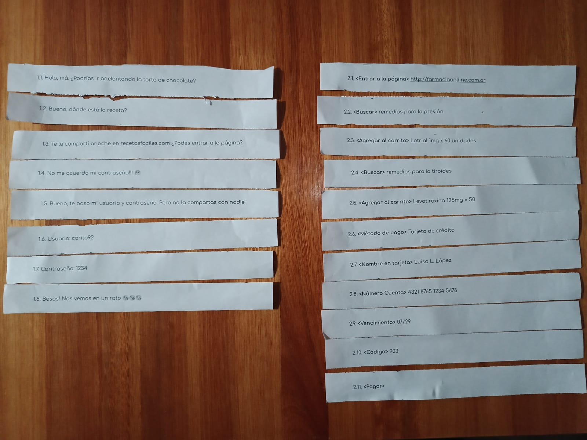
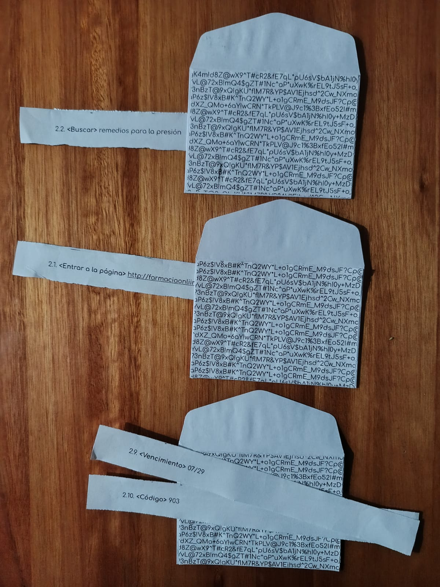
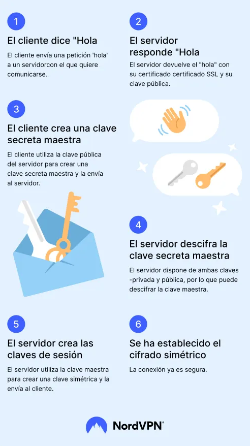
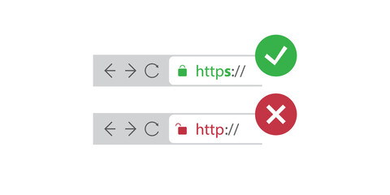
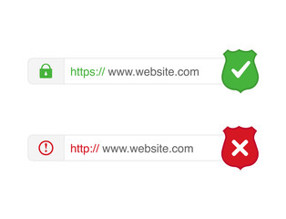
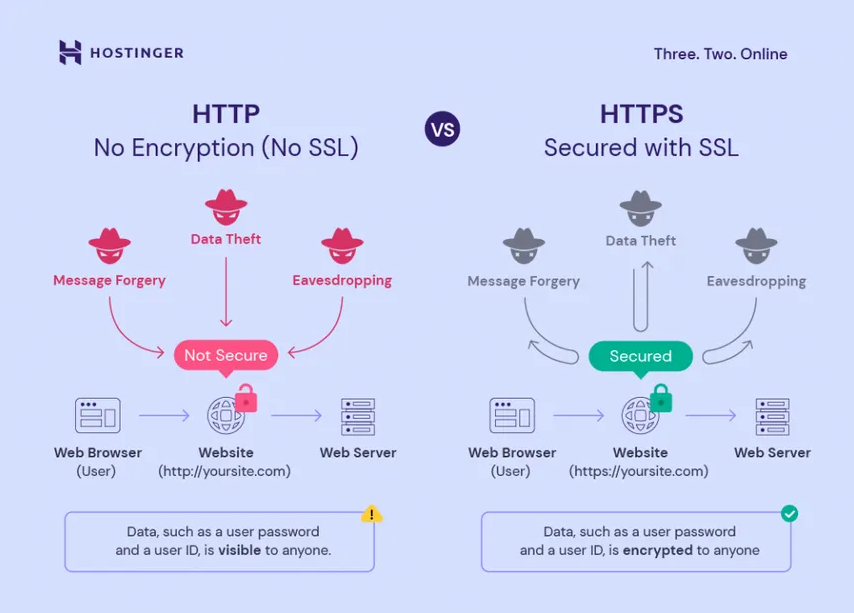
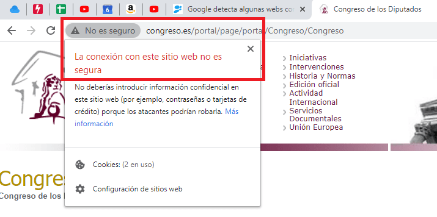
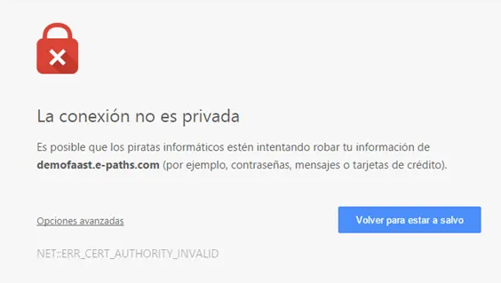
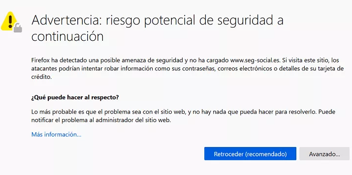
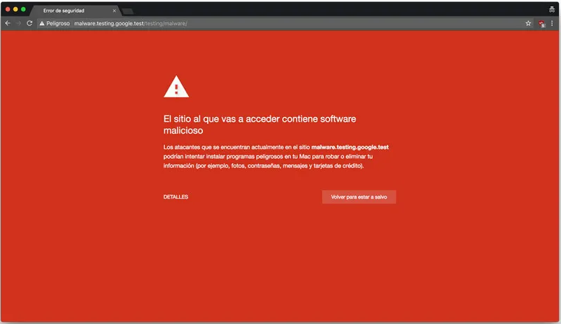

## Resumen

Actividad grupal en la que los participantes intercambian mensajes divididos en fragmentos y los hacen circular a través de una red simulada, donde cada participante es un nodo y cada sobre un paquete de información. De esta manera se busca representar de forma sencilla cómo viaja la información por Internet.

A partir de esta experiencia práctica, se exploran conceptos como la transmisión de datos, la privacidad, la protección de la información, la interceptación de comunicaciones y HTTPS mediante ejemplos y situaciones cotidianas, antes de introducir explicaciones técnicas.

La propuesta busca acercar estos temas utilizando una experiencia práctica antes de introducir explicaciones técnicas.

## Objetivos

- Comprender que Internet puede entenderse como una red de dispositivos conectados.
- Visualizar de forma simplificada cómo viaja la información entre distintos puntos de una red.
- Identificar riesgos de compartir datos sensibles en Internet.
- Identificar riesgos asociados a la interceptación de comunicaciones.
- Introducir conceptos básicos relacionados con HTTPS y certificados digitales.
- Reconocer la importancia de proteger la información durante su transmisión.
- Promover hábitos de uso más seguros y responsables en entornos digitales.

## Materiales necesarios

- Sobres blancos.
- Sobres oscurecidos con algún texto aleatorio.
- Mensajes de texto o imagen en fragmentos enumerados (2 como mínimo).
- Cinta adhesiva o pegamento (opcional).

## Guía para quien coordina

La actividad se basa en una representación simplificada de Internet. Los participantes asumen el rol de nodos que reciben y retransmiten información.

Antes de comenzar la dinámica se recomienda explicar brevemente qué representa cada elemento de la actividad: los participantes representan dispositivos o nodos de la red y los sobres representan paquetes de información.

Las consignas deben ser claras y concretas. A medida que se desarrollan las actividades, pueden incorporarse preguntas y explicaciones que ayuden a relacionar lo ocurrido con situaciones reales de uso de Internet.

Durante la actividad, se designa discretamente a una persona para capturar mensajes o fragmentos que circulan por la red sin informar este rol al resto del grupo. Esta intervención servirá posteriormente para reflexionar sobre la privacidad de las comunicaciones y sobre la dificultad de conocer quiénes tuvieron acceso a la información durante su recorrido.

El objetivo no es reproducir el funcionamiento técnico exacto de Internet, sino construir una representación sencilla que facilite la comprensión de conceptos vinculados con la transmisión y protección de la información.

## Introducción: ¿Qué es Internet?

Se presenta Internet como una gran red que conecta personas, dispositivos y servicios en todo el mundo.

Para ayudar a comprender cómo circula la información, puede explicarse que los mensajes suelen dividirse en pequeños fragmentos que viajan por distintos caminos de la red y luego se vuelven a unir al llegar a su destino.

## Analogías a utilizar

Puede utilizarse la analogía de una ciudad para representar el funcionamiento de Internet. Así como una persona puede desplazarse por calles y caminos para llegar a distintos lugares, la información circula por múltiples recorridos posibles hasta alcanzar su destino.

En una ciudad existen espacios públicos por los que cualquiera puede transitar, pero también establecimientos que requieren algún tipo de autenticación o identificación para ingresar. Del mismo modo, en Internet hay servicios y recursos de acceso abierto, mientras que otros solicitan credenciales para verificar la identidad de quien intenta acceder.

También puede mencionarse que no todos los lugares ofrecen el mismo nivel de seguridad. Algunas personas evitan ingresar a establecimientos que parecen poco confiables o que no brindan garantías adecuadas. De forma similar, en Internet existen sitios y servicios más seguros que otros, por lo que resulta importante aprender a reconocer señales que permitan evaluar su confiabilidad.

## Desarrollo de la actividad: Transmisión de mensajes

### Mensajes fragmentados

### Parte 1: transmisión de mensajes desprotegidos

Se divide un mensaje en varios fragmentos numerados.

Cada fragmento se coloca en un sobre blanco y debe viajar desde un origen hasta un destino atravesando distintos participantes que actúan como nodos de la red.

Los participantes pueden abrir los sobres, leer su contenido o simplemente reenviarlos. Mientras los mensajes circulan, una persona previamente designada puede capturar algunos fragmentos sin anunciar esta acción al resto del grupo.

Una vez finalizada la transmisión, se reconstruye el mensaje original y se conversa sobre lo ocurrido:

- ¿Alguien abrió los sobres?
- ¿Alguien leyó parte del mensaje?
- ¿Fue posible reconstruir información a partir de algunos fragmentos?
- ¿Quiénes tuvieron acceso al contenido durante el recorrido?

### Parte 2: transmisión de mensajes con protección adicional

Se repite la dinámica utilizando un nuevo mensaje.

En esta ocasión, los fragmentos se colocan dentro de sobres oscurecidos con texto adicional. Los participantes reciben la consigna de no abrir los sobres, aunque pueden intentar observar su contenido a contraluz.

Al igual que en la actividad anterior, algunos fragmentos pueden ser capturados durante la transmisión.

Una vez finalizado el recorrido, se reconstruye el mensaje y se comparan ambas experiencias:

- ¿Resultó más difícil acceder al contenido?
- ¿Qué diferencias se observaron respecto de la actividad anterior?
- ¿La información estuvo completamente protegida?
- ¿Qué limitaciones tuvo esta forma de protección?

A partir de esta comparación se introducen conceptos relacionados con privacidad, protección de la información, HTTPS y certificados digitales.

## Imágenes de referencia

### Conexión segura con certificado digital

### HTTPS

### Alertas de riesgo

## Recursos complementarios

### Ejemplo: Robo de credenciales en redes Wi-Fi públicas

> Una persona se conecta a una red Wi-Fi pública en una cafetería, aeropuerto o centro comercial y accede a servicios sensibles, como homebanking o compras en línea, sin prestar atención a la seguridad de la conexión.

### Caso Firesheep (2010)

Firesheep fue una extensión para el navegador Firefox lanzada en octubre de 2010 por el desarrollador Eric Butler con el objetivo de demostrar la vulnerabilidad de las sesiones web en redes públicas. La herramienta utilizaba un sniffer de paquetes para interceptar cookies de sesión no cifradas (HTTP) transmitidas por usuarios conectados a la misma red Wi-Fi abierta, permitiendo el secuestro de sesión (sidejacking) de cuentas en sitios como Facebook, Twitter y Flickr sin necesidad de conocer las credenciales de acceso.

[Codebutler - Firesheep (2010)](https://codebutler.com/2010/10/24/firesheep/)

### Hurricane Electric 3D Network Map

Mapa interactivo que permite visualizar parte de la infraestructura física de Internet y las conexiones entre distintas regiones del mundo. Resulta útil para comprender que Internet no es una entidad abstracta o una "nube", sino una red compuesta por equipos, enlaces y centros de datos distribuidos geográficamente.

[HE 3D Network Map - Global Internet Backbone](https://he.net/3d-map/)

### Submarine Cable Map

Mapa interactivo de cables submarinos utilizados para transportar grandes volúmenes de información entre continentes. Permite explorar cómo gran parte de las comunicaciones internacionales dependen de infraestructura física instalada en océanos y mares.

[Submarine cable map](https://www.submarinecablemap.com/)

## Preguntas frecuentes

> **¿Por qué algunos sitios muestran un candado?**
> 
> El candado indica que la conexión utiliza HTTPS y que la información intercambiada entre el dispositivo y el sitio web viaja protegida mediante cifrado durante la transmisión.

> **¿Qué es el cifrado?**
> 
> El cifrado es una técnica que transforma la información en un formato que resulta difícil de comprender para quienes no poseen la clave o el conocimiento necesario para interpretarla.
> La idea de ocultar mensajes no es nueva. Existen ejemplos sencillos de cifrado y codificación que se utilizan con fines educativos o recreativos:
> - Cifrado César: consiste en reemplazar cada letra por otra desplazada algunas posiciones en el alfabeto.
> - Jeringoso: una forma de hablar que intercala sílabas adicionales dentro de las palabras.
> - Pig Latin: un juego lingüístico popular en inglés que modifica el orden de las letras o sílabas de las palabras.
>
> Cuando una conexión utiliza HTTPS, la información viaja cifrada entre el dispositivo y el sitio web. Esto dificulta que terceros puedan leer su contenido durante la transmisión, incluso si logran interceptar parte de la comunicación.
> 
> Una analogía posible es enviar una carta escrita utilizando un código conocido únicamente por el remitente y el destinatario. Otras personas podrían ver la carta, pero tendrían dificultades para comprender su contenido.
> 
>> **Un caso histórico: la máquina Enigma.** 
>>
>> Durante la Segunda Guerra Mundial, las fuerzas armadas alemanas utilizaron la máquina Enigma para cifrar comunicaciones militares. Los mensajes podían ser interceptados por otros países, pero resultaban extremadamente difíciles de interpretar sin conocer la configuración utilizada para cifrarlos.
>> 
>> Para intentar comprender estas comunicaciones, distintos equipos de matemáticos, criptógrafos e ingenieros trabajaron en métodos para descifrar los mensajes. Entre ellos se destacó Alan Turing, quien participó en los esfuerzos realizados en Bletchley Park, Reino Unido, para analizar y descifrar comunicaciones protegidas mediante Enigma.
>>
>> Aunque los mensajes podían ser capturados durante su transmisión, el cifrado dificultaba enormemente su comprensión. Este caso suele utilizarse para ilustrar una idea fundamental de la criptografía: interceptar un mensaje no siempre significa poder entenderlo.
>> 
>> Los avances logrados durante este período tuvieron una gran influencia en el desarrollo de la criptografía moderna y de las ciencias de la computación.

> **¿Qué es un certificado digital?**
> 
> Un certificado digital es un documento electrónico que permite verificar la identidad de un sitio web y habilitar conexiones seguras mediante HTTPS. Los navegadores utilizan estos certificados para comprobar que están comunicándose con el sitio esperado y no con un tercero que intenta hacerse pasar por él.

> **¿Por qué es importante revisar el certificado digital?**
> 
> Un certificado vencido o inválido puede indicar problemas de configuración o dificultar la verificación de la identidad del sitio. Por este motivo, los navegadores suelen mostrar advertencias cuando detectan certificados que no son válidos.

> **¿HTTPS significa que una página es completamente segura?**
>
> No necesariamente. HTTPS ayuda a proteger la comunicación entre el dispositivo y el sitio web, pero no garantiza que el sitio sea confiable ni que la información publicada sea verdadera.
 
> **¿HTTPS y los certificados digitales garantizan seguridad total?**
> 
> No. HTTPS y los certificados digitales ayudan a proteger la información durante su transmisión y permiten verificar la identidad del sitio web, pero no impiden que una página contenga errores, información falsa o intenciones maliciosas.

> **¿Alguien puede ver lo que hago en Internet?**
> 
> Depende del servicio utilizado, la configuración de privacidad y las medidas de seguridad implementadas. Distintos actores pueden registrar o analizar parte de la actividad realizada en línea, aunque HTTPS dificulta que terceros puedan acceder al contenido de las comunicaciones durante la transmisión.

> **¿Qué es un ataque Man-in-the-Middle?**
> 
> Es un ataque en el que una persona o sistema se interpone entre dos partes que intentan comunicarse para observar, modificar o capturar información sin que los participantes lo adviertan.

> **¿Qué es un backbone?**
> 
> Un backbone es una red principal de alta capacidad que conecta distintas redes entre sí y transporta grandes volúmenes de información. Puede entenderse como una de las "autopistas" principales de Internet.

> **¿Qué es la fibra óptica?**
> 
> La fibra óptica es un medio físico utilizado para transmitir información mediante pulsos de luz. Permite alcanzar altas velocidades de transmisión y es una de las tecnologías más utilizadas para las conexiones modernas a Internet.

> **¿Qué es el Wi-Fi?**
> 
> Wi-Fi es una tecnología que permite conectar dispositivos a una red utilizando ondas de radio en lugar de cables. Generalmente, se utiliza para conectar teléfonos, computadoras y otros dispositivos al router del hogar o de una organización.
> **¿El Wi-Fi e Internet son lo mismo?**
> 
> No. Wi-Fi es una forma de conectar dispositivos a una red local de manera inalámbrica. Internet es la red global a la que esa red local puede estar conectada.
>
> **¿Qué son los datos móviles?**
> 
> Los datos móviles permiten acceder a Internet mediante la red de telefonía celular. A diferencia del Wi-Fi, la conexión se realiza utilizando la infraestructura del operador móvil.

> **¿Internet está en la nube?**
> 
> La expresión "la nube" suele utilizarse para simplificar la explicación de servicios e infraestructura en Internet. Sin embargo, la información realmente se almacena y transmite mediante computadoras, centros de datos, servidores, cables submarinos, antenas y otros componentes físicos distribuidos por todo el mundo.
> 
> En otras palabras, la nube no es un lugar misterioso o intangible. Se trata de un conjunto de computadoras y servidores conectados a Internet que almacenan información y ejecutan servicios para millones de personas.
> 
> Por ejemplo, cuando una persona guarda fotografías en Google Drive, envía un mensaje por WhatsApp o almacena documentos en un servicio en línea, esa información se guarda en computadoras ubicadas en centros de datos que pueden encontrarse en distintas ciudades o países.
>
> La palabra "nube" ayuda a simplificar la explicación, pero detrás de ella existe una gran infraestructura física que hace posible el funcionamiento de Internet.